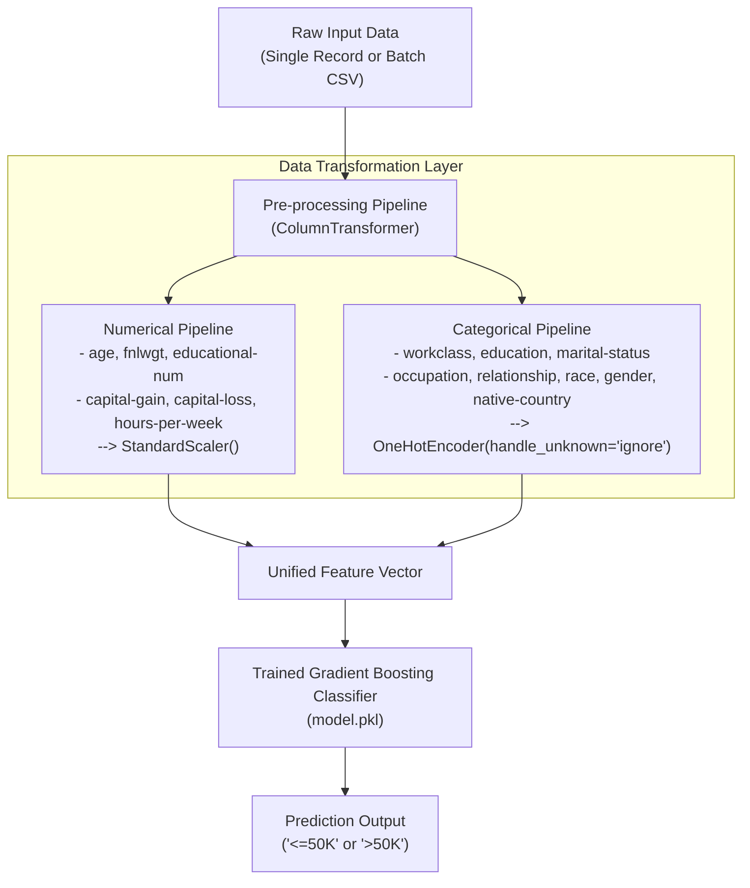

# 💼 Employee Salary Prediction ML App
# 💼 Employee Salary Prediction using Machine Learning
  
[](https://www.python.org/)
[](https://scikit-learn.org/)
[](https://streamlit.io/)
[](https://pandas.pydata.org/)
[](https://numpy.org/)
An end-to-end Machine Learning web application that predicts whether an individual earns **more than \$50,000 annually (`>50K`)** or **\$50,000 or less (`<=50K`)** based on census demographic and employment features. Built on the renowned **UCI Adult Census Income dataset**, packaged with a **scikit-learn Pipeline**, and deployed via an interactive **Streamlit** dashboard with real-time inference and bulk CSV batch processing.
---
## 📌 Project Overview
## 📌 Table of Contents
- [Project Overview](#-project-overview)
- [Key Features](#-key-features)
- [System Architecture & ML Pipeline](#-system-architecture--ml-pipeline)
- [Model Evaluation & Benchmarking](#-model-evaluation--benchmarking)
- [Dataset & Feature Dictionary](#-dataset--feature-dictionary)
- [Repository Structure](#-repository-structure)
- [Quickstart & Installation](#-quickstart--installation)
- [How to Use the Web App](#-how-to-use-the-web-app)
- [Engineering Highlights & Best Practices](#-engineering-highlights--best-practices)
- [Future Roadmap](#-future-roadmap)
- [License](#-license)
This project predicts whether an employee earns **≤50K or >50K** using demographic and work-related features from the **UCI Adult dataset**, deployed as an interactive web app using **Streamlit**.
---
## 📖 Project Overview
Determining employee compensation tiers is critical for HR workforce analytics, market salary calibration, and demographic economic research. 
This project solves this binary classification challenge by:
1. Conducting exploratory data analysis (EDA) and cleaning raw census data.
2. Building an automated, leakage-free preprocessing pipeline using `ColumnTransformer`.
3. Training and benchmarking five distinct supervised classification algorithms.
4. Selecting the top-performing model (**Gradient Boosting Classifier - 86.77% Accuracy**).
5. Deploying the serialized pipeline (`model.pkl`) inside an intuitive Streamlit web application.

## 🚀 Features
## 🚀 Key Features
- Data cleaning and preprocessing pipeline
- Trained multiple models:
  - Logistic Regression
  - Random Forest
  - Gradient Boosting (**Best: ~86% accuracy**)
  - Support Vector Machine (SVM)
  - K-Nearest Neighbors (KNN)
- Pipeline integration with scikit-learn
- Streamlit app with:
  - Sidebar input for employee features
  - Batch prediction via CSV upload
  - Professional background theme and clean UI
* **Interactive Single Prediction UI**: Intuitive sidebar controls (sliders, select boxes, numeric inputs) allowing users to adjust employee parameters and get instant salary classifications.
* **Batch CSV Processing**: Upload bulk employee records via CSV, execute vectorized model predictions, view an in-browser preview, and download the annotated CSV with predictions in one click.
* **Custom Themed UI**: Modern, glassmorphism-styled dashboard using a responsive background theme (`theme.png`).
* **Production-Grade scikit-learn Pipeline**: Bundles data scaling (`StandardScaler`) and encoding (`OneHotEncoder`) directly with the estimator, eliminating train-test data leakage and ensuring seamless inference on raw data.
* **Robust Category Handling**: Configured with `handle_unknown='ignore'` to gracefully process previously unseen categorical values at inference time without breaking.
---
## 🛠️ Technologies Used
## ⚙️ System Architecture & ML Pipeline
- **Languages & Libraries:** Python, pandas, numpy, seaborn, matplotlib
- **Machine Learning:** scikit-learn (Pipeline, ColumnTransformer, models)
- **Deployment:** Streamlit
- **Serialization:** joblib

---
## 📁 Dataset
## 📊 Model Evaluation & Benchmarking
- **Source:** [UCI Machine Learning Repository - Adult Dataset](https://archive.ics.uci.edu/ml/datasets/adult)
- **File:** `adult.csv`
- **Description:** Contains demographic and employment data for salary classification tasks.
Five machine learning models were systematically evaluated on a held-out test split of **9,224 records**.

### Benchmark Comparison
| Model | Test Accuracy | Precision (`>50K`) | Recall (`>50K`) | F1-Score (`>50K`) | Status |
| :--- | :---: | :---: | :---: | :---: | :---: |
| **Gradient Boosting Classifier** | **86.77%** | **0.80** | **0.61** | **0.69** | 🏆 **Selected Best Model** |
| Support Vector Machine (SVM) | 85.71% | 0.77 | 0.59 | 0.67 | Benchmark |
| Logistic Regression | 85.23% | 0.75 | 0.60 | 0.67 | Baseline |
| Random Forest Classifier | 85.09% | 0.72 | 0.63 | 0.67 | Benchmark |
| K-Nearest Neighbors (KNN) | 83.25% | 0.68 | 0.61 | 0.64 | Baseline |
### Champion Model Classification Report (Gradient Boosting)
```
              precision    recall  f1-score   support
       <=50K       0.88      0.95      0.92      6962
        >50K       0.80      0.61      0.69      2262
    accuracy                           0.87      9224
   macro avg       0.84      0.78      0.80      9224
weighted avg       0.86      0.87      0.86      9224
```
> **Key Insight**: Gradient Boosting achieved the highest overall accuracy (86.77%) and the strongest precision (80%) for the high-income (`>50K`) minority class, ensuring fewer false-positive high salary predictions.
---
## 🧠 Key Learnings
## 📁 Dataset & Feature Dictionary
✔️ End-to-end ML project workflow  
✔️ Data preprocessing and handling missing values  
✔️ Feature engineering and encoding  
✔️ Model training, evaluation, and selection  
✔️ Deploying ML models as web apps using Streamlit
The model is trained on the **UCI Adult Census Dataset** (`adult.csv`), containing 48,842 rows with demographic and employment attributes:

| `age` | Integer | Age of the individual | 18 - 65+ |
| `workclass` | Categorical | Employment sector | Private, Self-emp, Federal-gov, Local-gov, etc. |
| `fnlwgt` | Continuous | Final census population sample weight | Numeric continuous |
| `education` | Categorical | Highest level of education achieved | Bachelors, Masters, PhD, HS-grad, Assoc, etc. |
| `educational-num` | Integer | Total years of formal education | 1 - 16 |
| `marital-status` | Categorical | Marital status | Never-married, Married-civ-spouse, Divorced, etc. |
| `occupation` | Categorical | Profession / Job category | Tech-support, Exec-managerial, Prof-specialty, Sales, etc. |
| `relationship` | Categorical | Relationship role in household | Wife, Own-child, Husband, Not-in-family, etc. |
| `race` | Categorical | Demographic race | White, Asian-Pac-Islander, Black, etc. |
| `gender` | Categorical | Biological gender | Male, Female |
| `capital-gain` | Continuous | Monetary capital gains in USD | Numeric ($0 - $99,999) |
| `capital-loss` | Continuous | Monetary capital losses in USD | Numeric ($0 - $4,356) |
| `hours-per-week` | Integer | Working hours per week | 1 - 80+ |
| `native-country` | Categorical | Country of origin | United-States, India, Germany, Canada, etc. |
| **`income`** *(Target)* | Binary | Annual income threshold | **`<=50K`** or **`>50K`** |
---
## 📝 Algorithm
## 📂 Repository Structure
1. Import libraries and load dataset
2. Replace missing values and drop duplicates
3. Remove outliers for age and educational-num
4. Encode categorical columns with LabelEncoder
5. Define feature set `x` and target `y`
6. Split data into training and test sets
7. Build a pipeline:
   - Numeric: StandardScaler
   - Categorical: OneHotEncoder
8. Train multiple models and evaluate their performance
9. Select and save the best model using joblib
10. Build and deploy Streamlit app with interactive UI for predictions
```
Employee-Salary-Prediction-using-Machine-Learning-main/
│
├── adult.csv                        # Raw UCI Census Income dataset (48k+ records)
├── EmployeeSalaryPrediction.ipynb  # Jupyter Notebook: EDA, preprocessing, model training & benchmarking
├── model.pkl                        # Serialized scikit-learn Pipeline (Preprocessor + GradientBoosting)
├── prediction.py                    # Streamlit web application frontend & inference engine
├── requirements.txt                 # Project dependencies (pandas, scikit-learn, streamlit, etc.)
├── theme.png                        # Background image asset for Streamlit UI
└── README.md                        # Project documentation & execution guide
```
---

### Mode 1: Individual Prediction
1. Open the left sidebar in the web app.
2. Adjust demographic parameters (Age, Education, Occupation, Marital Status, Hours per week, etc.).
3. Review the populated single-row preview in the main panel.
4. Click **"💡 Calculate Salary"** to view the real-time classification (`<=50K` or `>50K`).
### Mode 2: Batch CSV Inference
1. Prepare a `.csv` file matching the feature columns (e.g. sample rows from `adult.csv`).
2. Navigate to the **"📂 Batch Prediction"** section on the main screen.
3. Drag-and-drop or browse to upload your CSV file.
4. The system executes vectorized inference and appends a `PredictedClass` column.
5. Click **"⬇️ Download Predictions CSV"** to save your results.
---
## 💡 Engineering Highlights & Best Practices
1. **Zero Data Leakage**: Transformations (`StandardScaler`, `OneHotEncoder`) are fitted strictly within cross-validation folds and training partitions via `sklearn.pipeline.Pipeline`.
2. **Encapsulated Artifact**: The saved `model.pkl` is a complete composite pipeline. The web application feeds raw DataFrames directly into `model.predict(input_df)` without needing manual scaling or one-hot encoding code inside the web server.
3. **Resilient Categorical Encoding**: Categorical encoders use `handle_unknown='ignore'`, preventing runtime crashes when novel or rare categories are introduced in user input.
4. **Vectorized Batch Processing**: Uses Pandas vectorized operations for batch uploads, allowing processing of thousands of records in seconds.
---
## 🔮 Future Roadmap
- [ ] **Class Imbalance Optimization**: Implement SMOTE (Synthetic Minority Over-sampling Technique) or cost-sensitive learning to boost recall on the `>50K` minority class.
- [ ] **Hyperparameter Optimization**: Conduct Bayesian optimization with Optuna to tune Gradient Boosting estimators and tree depths.
- [ ] **Explainable AI (XAI)**: Integrate **SHAP** (SHapley Additive exPlanations) into the Streamlit dashboard to explain individual feature contributions for each prediction.
- [ ] **Containerization & Cloud Deployment**: Add `Dockerfile` and deploy the service on cloud platforms (e.g., Streamlit Community Cloud, Render, or AWS ECS).
---
## 📜 License
This project is licensed under the **MIT License** - see the [LICENSE](LICENSE) file for details.
---
## 🤝 Acknowledgements
* [UCI Machine Learning Repository](https://archive.ics.uci.edu/ml/datasets/adult) for providing the Adult Census Income dataset.
* [scikit-learn](https://scikit-learn.org/) and [Streamlit](https://streamlit.io/) open-source communities.
